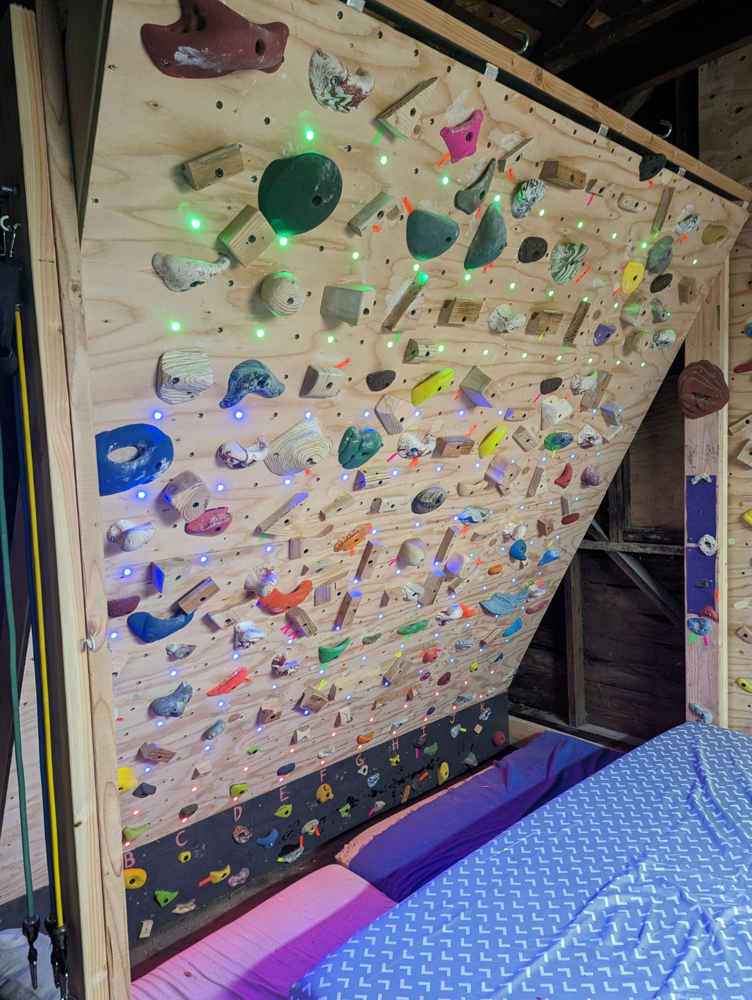
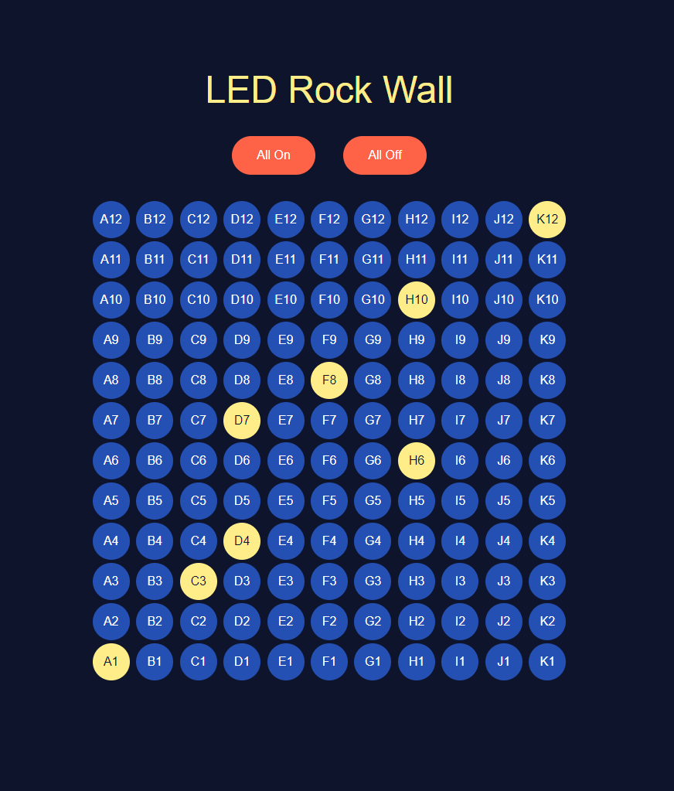
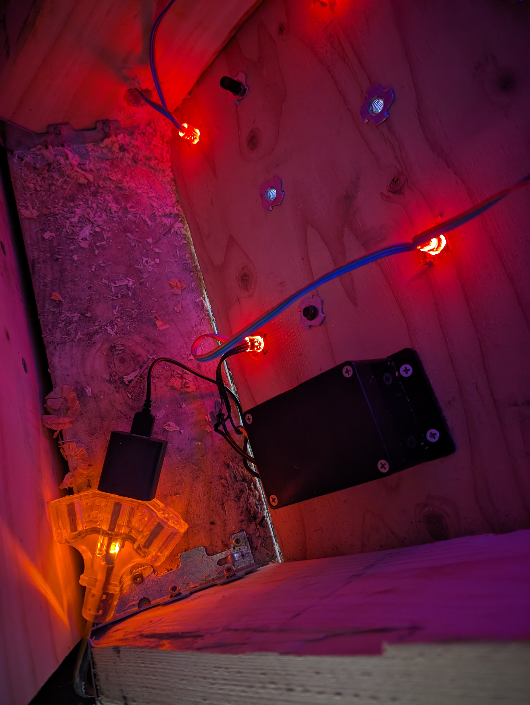
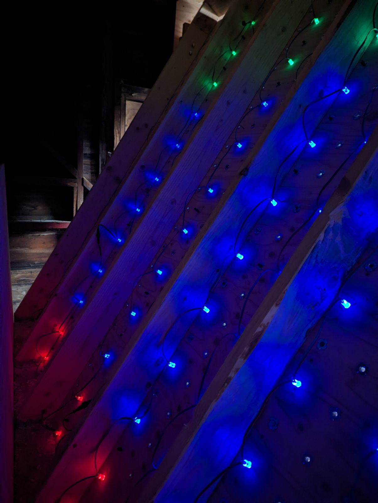
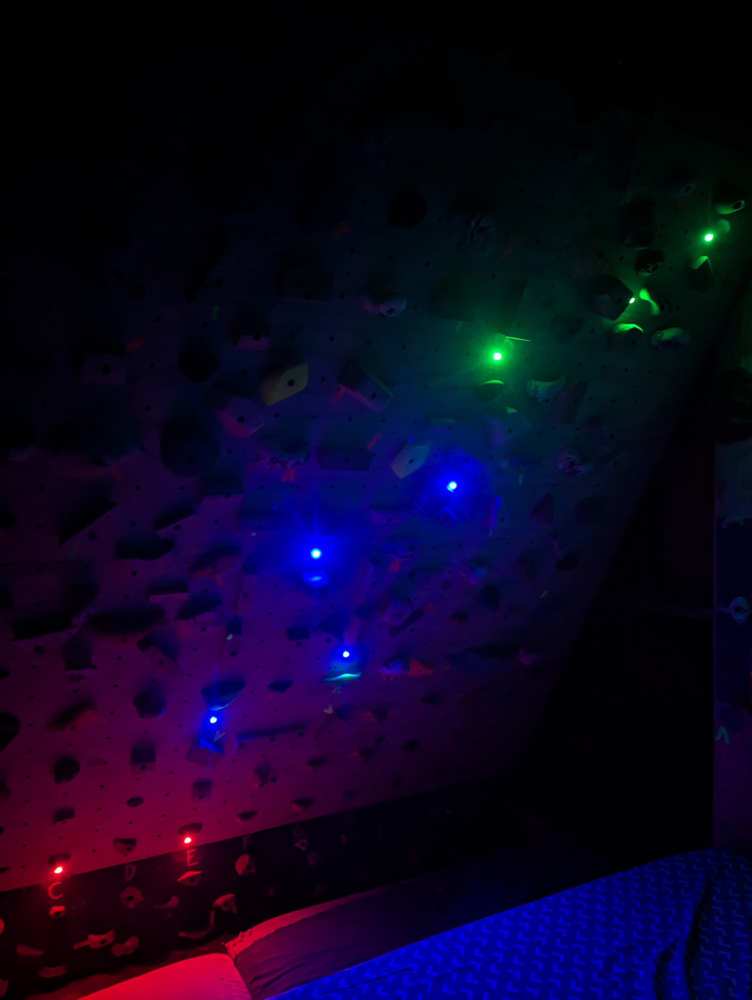
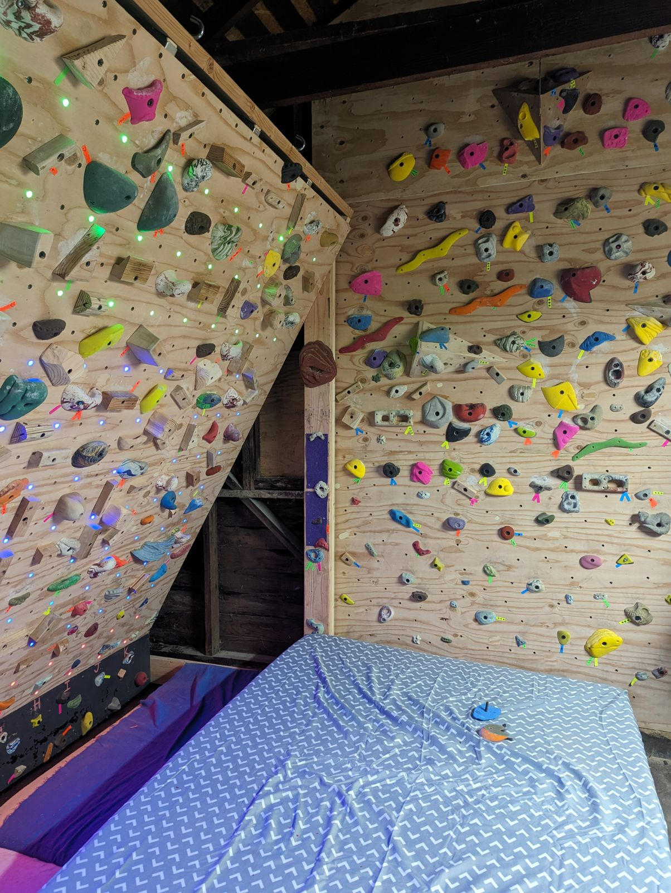

# ESP32-LED-Rock-Wall v1.0

## Summary

Rock climbing walls are now incorporating addressable LED lights with applications that allow users to set, save, and share custom climbing routes. While there are a few options available online, the lights and software can easily cost over $1,000. This open source repo allows you to create a simple websocket application with similar functionality, at a fraction of the cost.



### Functionality

- Control individual lights under climbing holds to highlight custom routes
- Turn on/off all the lights at once

### Future Improvements

- Use async requests to avoid page refreshes when toggling lights
- Save custom routes
- Adjust light colors from the app
- A login page with a form for the WiFi SSID and password
- Fun RGB effects because why not


## Hardware

- (1) <a href="https://www.amazon.com/gp/product/B08246MCL5/ref=ppx_yo_dt_b_search_asin_title?ie=UTF8&psc=1">ESP32 Microcontroller</a>
- (1) <a href="https://www.amazon.com/MTYTOT-100V-240V-Switching-Converter-Transformer/dp/B0BXWZ99RZ/ref=sr_1_3?crid=2Q6LIU0XZMFT5&dib=eyJ2IjoiMSJ9.hhsY_vZl4Ugjh0N1mL9Qob7DOrWor4fw1gXnFHd7Z8nQyRGcjrTmOCRWmGYZ3ucTF2cl0TC-Jihojegukb1FK0n78mhY8akai2H7KsOr9SRJfWeZkMQhOhtR532jOvQYAZAKJ9bZNKza4EPTx5HdxCRclXBSimrburMSics6KvlAmZE8fyrxEYgKwdQEw8vIEUbA3DRdSaJH5oBSAq0VkxsnzSTUeOR06JlpWorDVX8.1UE1ij9wl6-dbhJQFD4nAQ7ooJ6CHHqUNOSuAN4dtvk&dib_tag=se&keywords=mtytot+dc+5v+10a+power&qid=1708971649&sprefix=mtytot+dc+5v+10a+powe%2Caps%2C128&sr=8-3">
5V 10A Power Supply with DC Terminal Connector</a>
- (3) <a href="https://www.aliexpress.us/item/3256801674884092.html?gatewayAdapt=glo2usa4itemAdapt">50pcs 5v WS2811 12mm Addressable LED Smart Pixel Nodes on 25cm Spacing</a>
- (1) <a href="https://www.acehardware.com/departments/lighting-and-electrical/boxes-fittings-and-conduit/lugs/3021896">Box of 22-16 AWG Twist-on Wire Connectors</a>
- (1) <a href="https://www.amazon.com/gp/product/B07TYNYW1S/ref=ppx_yo_dt_b_search_asin_title?ie=UTF8&psc=1">Project Box</a>
- (3) 12" strips of 18AWG stranded wire in 3 colors
- (1) Micro usb to USB-A cable
- (1) Soldering iron and solder
- (1) 220 ohm resistor
- (1) Electric drill with 1/2" and 5/8" bits

## Things to Know

This template is based on a wall with 12 rows and 11 columns, equalling 132 LED lights. The wall was made using the <a href="https://tensionclimbing.com/">Tension Board</a> as a template. If your grid is of different dimensions, you can adjust the grid dimension values.
``` 
// Grid dimensions
const int rows = 12;
const int cols = 11;
``` 

If you want to change the colors of the LEDs, you can do so by adjusting the CRGB values.

```
// Color definitions
CRGB startColor = CRGB(0, 255, 0);  // Green
CRGB middleColor = CRGB(0, 0, 255);   // Blue
CRGB finishColor = CRGB(255, 0, 0);    // Red
```

If you want to change which rows are the start, middle, or finish, you will need to update the row numbers manually.

```
  // Update physical LEDs and set color based on the row
  if (ledStates[row][col]) {
    if (row <= 2) {
      leds[index] = finishColor;  // Rows 1 and 2: Green color
    } else if (row >= 3 && row <= 9) {
      leds[index] = middleColor;   // Rows 3 to 9: Blue color
    } else {
      leds[index] = startColor;    // Rows 10 to 12: Red color
    }
  } else {
    leds[index] = CRGB::Black;  // Turn off: Black color
  }
```

You must connect to a WiFi network to use the websocket application. Enter your WiFi network SSID and password as strings.

```
// Replace with your network credentials
const char* ssid = "<your-network-name>";
const char* password = "<your-network-password>";
```

#### Electrical Limitations and Considerations

When only using a single color channel like CRGB(255, 0, 0), an LED will use ~20mA.
When using all 3 colors channels like CRGB(255, 255, 255), an LED will use ~60mA.
It is important to remember this when considering how many LEDs you plan to use and how you intend to light them. With a 10A power supply, you should not exceed 80% of it's capacity, therefore keep the total amperage below 8A.

For example:
- If using only 1 color channel per LED, you could power up to 400 LEDs safely.
- If using all 3 color channels per LED, you could power up to 133 LEDs safely.

If you're using a lot of lights, the LEDs at the end of your array might appear dimmer than those at the beginning. If this is the case, you might consider injecting power to those strips as explained in <a href="https://www.youtube.com/watch?v=KFtjf5mD6tA&t=159s&ab_channel=ChrisMaher">this video.</a> That is what the two extra red and white wires in the LED strip are for.

I've chosen the specific lights in this README because they are 5V, which means they can work well with the ESP32 and share a power supply, and also because the length between each light is 25cm (9.8"). The wall this was installed on has hold spacings 8" apart, so this ensures the lights will reach each hold.

### Known Bugs

- Sometimes on startup, the LED at index 0 will automatically be turned on.
- When using Safari, the app will randomly toggle the LED at index 0 when other lights are toggled. This likely has something to do with how Safari handles the websocket connection. To prevent this issue, please use Chrome, Brave, Firefox, Edge, or other compatible browsers.
- If you get this warning when uploading to the ESP32, it's okay because we are not using any SPI pins.
```
No hardware SPI pins defined.  All SPI access will default to bitbanged output
```


## Installation

### Install the Arduino IDE and Upload Code to the ESP32

- <a href="https://www.arduino.cc/en/software">Download</a> and install the Arudino IDE application for your OS</a>
- Open the Arduino IDE and connect your ESP32 to your computer
- Go to Tools > Manage Libraries. In the library manager, search for esp32. Install esp32 by Espressif Systems.
- In the library manager, also search for and install the FastLED library by Daniel Garcia.
- Once these libraries are installed, select the board manager dropdown at the top of the application, and select the ESP32-WROOM-DA Module board on the COM port you plugged it into. If you are unsure which COM port you're plugged into, click on the dropdown, unplug and replug your device to see which port disappears then reappears. That'll be the one.
- Replace all of the code in the Arudino IDE editor with the code in <b>esp32-led-rock-wall.ino</b> from this repo.
- Look for the WiFi credential placeholders, and replace them with your WiFi network name and password. They should be strings (in quotes).
- In the top right of the application, click on the Serial Monitor button to open it.
- To the far right of the serial monitor, change the baud rate to 115200 to match the serial baud rate of the application.
- Click the upload button to upload the code to the ESP32. If you get any errors, follow the instructions. If you can't figure it out, feel free to reach out to me via the contact email at the bottom of this README, and I will try my best to assist you.
- While the code is uploading, keep an eye on the serial monitor. As soon as the code finishes uploading to the ESP32, the device will attempt to connect to the WiFi network. When it does, it will print out the device IP address in the serial monitor. Copy and paste that IP address into the browser to access the websocket application.
- Either bookmark that URL or add the page as a button on your home screen if using a mobile device for easy access in the future.


### Preparing the ESP32 for Install

Ensure your ESP32 is now unplugged from the computer. If you're using more than 50 LEDs, I would recommend using an external power supply. If not, you can power things with just the microusb cable. The following instructions will outline using an external power supply. Start by stripping both ends of your 3 strips of 18AWG wire, and saudering one side of each to the appropriate header pins of your ESP32.
- Red wire to VIN
- White or black wire to GND
- Green or any other color wire to GPIO32

### Connecting Power

#### IMPORTANT REMINDER

Do not power your ESP32 by both the 5V pin connected to the power supply AND the microusb cable at the same time! We're relying on the power supply from now on, so do not use that microusb cable unless you need to update the code via your computer. If you do need to do that, ensure the ESP32 is not also connected to the external power supply.

- Drill a 1/2" hole in one side of your project box.
- Find the start of only one of your LED strips. Cut the plug off that side.
- Feed all of these wires through the hole in your project box from the outside. 
- Separate and strip the 3 LED wires. 
- <b>Ensure the power supply is unplugged from the wall.</b>Feed the end of the power supply cable into the box, through the hole, from the outside. You might need to remove the terminal adapter to fit the cable through the hole.
- Place the ESP32 inside the project box.
- Use a wire nut to twist the power wires of the ESP32 and LED strip together, ensuring that some of the wire below the nut is twisted together as well. This will ensure a strong connection. Remove the wire nut, then insert the married wires into the power supply's positive terminal.
- Repeat the previous step for the ground wires of the ESP32, LED strip, and negative terminal.
- Ensure no excess wire is exposed outside the terminal connections. If there is exposed wire outside the terminals, remove the wires, clip them shorter, then reinsert them.
- Ensure the terminal screws are snug.
- Now, when joining the data wires, if using an external power supply, add a 220ohm resistor between the lead coming off the ESP32 and the LED strip using a wire nut, or solder. Then connect the two ends together just like you did with the power and gnd wires.  Ensure they are twisted together with a strong connection and there is no exposed wire. This will help reduce noise on the data line and allow your lights to function properly. You can omit the resistor if using just the micro usb cable for power.
- Connect the remaining LED strips together using their built in plugs.
- Cut an extra lights off and tape over the ends.
- Carefully tuck all of the wires inside the box, and close it up using the screws provided.


### Testing Lights

- Now that everything is wired up, plug in the power supply.
- Give the ESP32 a few seconds to connect to the network, then visit the IP/URL you saved earlier in the browser to open the application.
- The first time the ESP32 is connected, some lights may randomly light up, and in varied colors. Use the "All Off" button to turn them off. After the initial connection, toggling lights should work as expected.
- Click through a range of lights from the first to the last row, to ensure they're all turning on in the correct order.
- Click the "All On" button to ensure everything turns on.
- Click the "All Off" button to ensure everything can turn off.
- If everything appears to be working as planned, proceed to installing the lights.



### Installing Lights in the Wall

These Pixel LEDs are 13.6mm in diameter at their widest point, and therefore need holes drilled to 5/8" below each hold.

- Mount the project box to the back of the wall, such that the first LED can reach hold A1, the bottom left hold of the board.
- The LED lights will follow a serpentine path during installation. The first LED in your strip should be placed in the hole at A1. The next LED should then route to B1, then C1, etc until K1, at which point the next LED should go to K2. Then work your way back along row 2 to A2. Continue this serpentine pattern to ensure the LEDs on the wall match with the LEDs in the app. Feel free to test this before officially installing them all. You may choose to use tape or other adhesives to ensure the lights are secure in their holes.
- Once you've reached the end, and tested that the lights and app are working as intended, feel free to cut off the excess lights and tape the ends of your wires with electrical tape.
- Congratulations, you did it! Now enjoy that beautiful new wall and come up with some fun routes!






### Author

Cody Barker

### Licensing

This project is unlicensed and free to use.

### For Contributors

Feel free to fork this repo and reach out to me with suggestions and feedback.

### Contact

codybarker.or@gmail.com

### Last Update

3/8/24